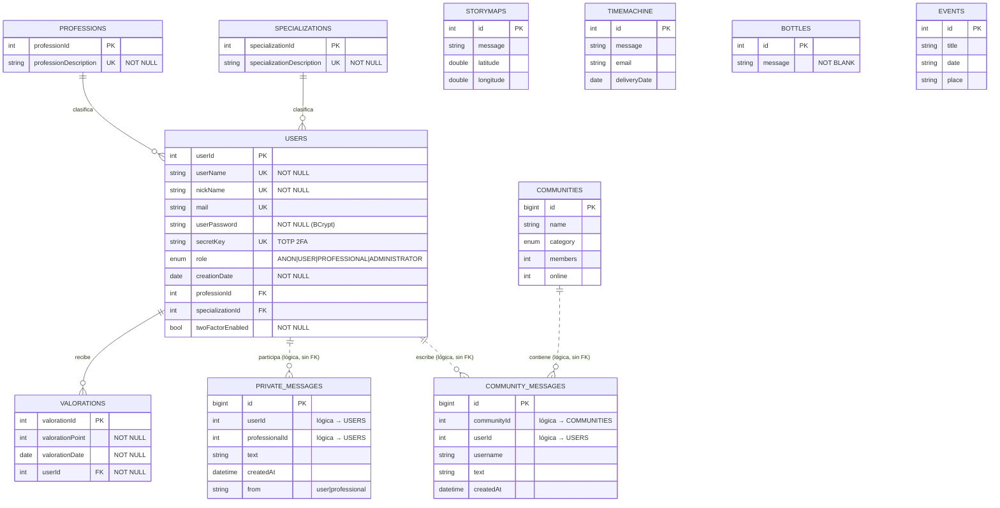

# Modelo Entidad-Relación — ShareYourStory

Modelo de datos real generado por Hibernate a partir de las entidades JPA
(`src/main/java/shareyourstory/domain/**/model`).

## Diagrama E/R



## Entidades

| Tabla | Entidad JPA | Descripción |
|---|---|---|
| `users` | `User` | Cuentas (anónimas, usuarios, profesionales, administradores). Implementa `UserDetails`. |
| `professions` | `Profession` | Catálogo de profesiones de los profesionales. |
| `specializations` | `Specialization` | Catálogo de especializaciones. |
| `valorations` | `Valoration` | Valoraciones recibidas por un usuario/profesional. |
| `storyMaps` | `StoryMap` | Historias anónimas geolocalizadas (mapa mundial). |
| `TimeMachine` | `TimeMachine` | "Carta al futuro": mensaje + email + fecha de entrega. |
| `bottles` | `Bottle` | "Botella flotante": mensaje anónimo. |
| `private_messages` | `PrivateMessage` | Mensajes 1:1 usuario ↔ profesional. |
| `communities` | `Community` | Comunidades temáticas de apoyo. |
| `community_messages` | `CommunityMessage` | Mensajes de chat dentro de una comunidad. |
| `events` | `Event` | Eventos de la comunidad. |

## Relaciones

### Con integridad referencial (FK física en BD)
- **`users` N:1 `professions`** — `users.professionId → professions.professionId`
- **`users` N:1 `specializations`** — `users.specializationId → specializations.specializationId`
- **`valorations` N:1 `users`** — `valorations.userId → users.userId` (NOT NULL)

### Relaciones lógicas (aún sin FK física)
Estas columnas referencian a otras tablas por `id` pero **no** declaran clave
foránea, por lo que el SGBD no garantiza la integridad:
- `private_messages.userId` / `private_messages.professionalId` → `users.userId`
- `community_messages.communityId` → `communities.id`
- `community_messages.userId` → `users.userId`

> **Mejora futura (opcional):** convertirlas en `@ManyToOne` con `@JoinColumn`
> añadiría integridad referencial. No se hace ahora para no interferir con el
> desarrollo activo de esas features ni con datos ya insertados.

## Restricciones de integridad

| Tipo | Dónde |
|---|---|
| **PK** | Todas las tablas (autoincremental, `GenerationType.IDENTITY`). |
| **UNIQUE** | `users.userName`, `users.nickName`, `users.mail`, `users.secretKey`; `professions.professionDescription`; `specializations.specializationDescription`. |
| **NOT NULL** | `users.userName/nickName/userPassword/creationDate/role/twoFactorEnabled`; `valorations.*`; etc. |
| **FK** | Ver sección "Relaciones". |
| **Enum** | `users.role` (`UserRole`), `communities.category` (`CommunityTypes`). |
| **Validación (capa app)** | `@Email` en `TimeMachine.email`; `@NotBlank` en `Bottle.message`. |

## Obtener el esquema real (DDL) desde la BD

El DDL exacto lo genera Hibernate. Para exportarlo como referencia/documentación:

```bash
docker compose -f .devcontainer/compose.yml exec mysql \
  mysqldump -u root -ppasahitza --no-data --skip-comments shareYourStory > db/schema-snapshot.sql
```
