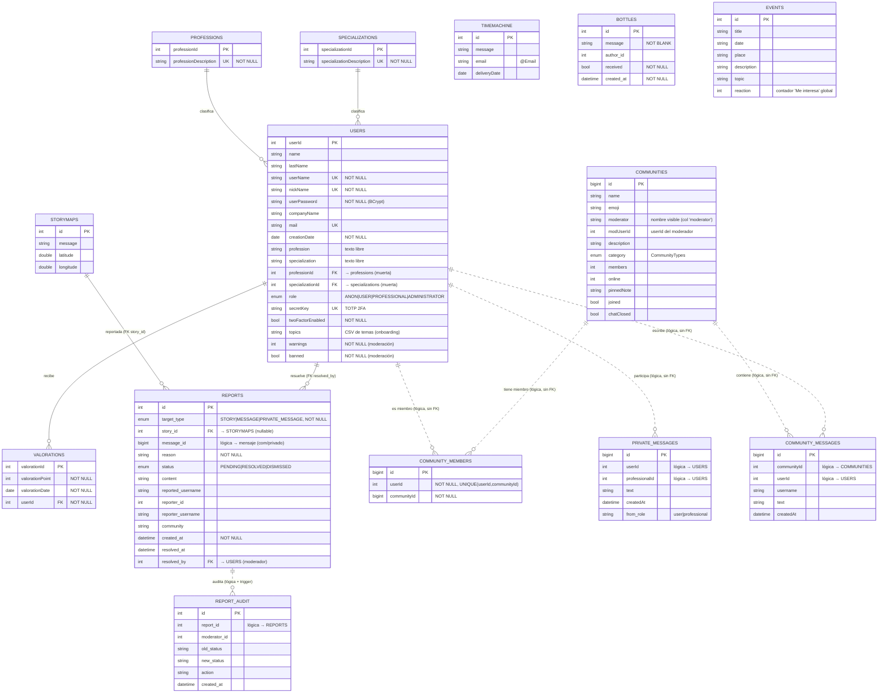

# Modelo Entidad-Relación — ShareYourStory

Modelo de datos real generado por Hibernate a partir de las entidades JPA
(`src/main/java/shareyourstory/domain/**/model`).

## Diagrama E/R



## Entidades

| Tabla | Entidad JPA | Descripción |
|---|---|---|
| `users` | `User` | Cuentas (anónimas, usuarios, profesionales, administradores). Implementa `UserDetails`. Incluye 2FA (`secretKey`/`twoFactorEnabled`), `topics` (onboarding) y moderación (`warnings`/`banned`). |
| `professions` | `Profession` | Catálogo de profesiones. **Entidad muerta** (FK desde `users`, sin uso real — ver Roadmap). |
| `specializations` | `Specialization` | Catálogo de especializaciones. **Entidad muerta** (ídem). |
| `valorations` | `Valoration` | Valoraciones recibidas por un usuario. **Entidad muerta** (sin uso real). |
| `storyMaps` | `StoryMap` | Historias anónimas geolocalizadas (mapa mundial). |
| `TimeMachine` | `TimeMachine` | "Carta al futuro": mensaje + email + fecha de entrega (la elige el usuario). |
| `bottles` | `Bottle` | "Botella al mar": mensaje anónimo con autor, marca de recibida y fecha. |
| `private_messages` | `PrivateMessage` | Mensajes 1:1 usuario ↔ profesional (chat privado, `/api/chats`). |
| `communities` | `Community` | Comunidades temáticas de apoyo (con moderador, nota fijada, chat abierto/cerrado). |
| `community_members` | `CommunityMember` | **Membresía** usuario↔comunidad. Único por `(userId, communityId)`. |
| `community_messages` | `CommunityMessage` | Mensajes de chat dentro de una comunidad. |
| `reports` | `Report` | Reportes de moderación de **historias, mensajes de comunidad y mensajes privados** (`target_type`). |
| `report_audit` | `ReportAudit` | Auditoría de cambios de estado de un reporte. La rellena el trigger `trg_reports_audit` (`db/06`). |
| `events` | `Event` | Eventos de la comunidad (con contador global "Me interesa"). |

## Relaciones

### Con integridad referencial (FK física en BD)
- **`users` N:1 `professions`** — `users.professionId → professions.professionId` (FK a entidad muerta)
- **`users` N:1 `specializations`** — `users.specializationId → specializations.specializationId` (FK a entidad muerta)
- **`valorations` N:1 `users`** — `valorations.userId → users.userId` (NOT NULL)
- **`reports` N:1 `storyMaps`** — `reports.story_id → storyMaps.id` (`@ManyToOne`, **nullable**: solo cuando `target_type = STORY`)
- **`reports` N:1 `users`** — `reports.resolved_by → users.userId` (`@ManyToOne`, moderador que resolvió; nullable)

### Relaciones lógicas (aún sin FK física)
Estas columnas referencian a otras tablas por `id` pero **no** declaran clave
foránea, por lo que el SGBD no garantiza la integridad:
- `community_members.userId` → `users.userId`; `community_members.communityId` → `communities.id` (con UNIQUE de pareja)
- `private_messages.userId` / `private_messages.professionalId` → `users.userId`
- `community_messages.communityId` → `communities.id`; `community_messages.userId` → `users.userId`
- `reports.message_id` → el mensaje reportado (de comunidad o privado, según `target_type`); `reports.reporter_id` → `users.userId`
- `report_audit.report_id` → `reports.id`; `report_audit.moderator_id` → `users.userId`

> **Mejora futura (opcional):** convertirlas en `@ManyToOne` con `@JoinColumn`
> añadiría integridad referencial. No se hace ahora para no interferir con el
> desarrollo activo de esas features ni con datos ya insertados.

## Restricciones de integridad

| Tipo | Dónde |
|---|---|
| **PK** | Todas las tablas (autoincremental, `GenerationType.IDENTITY`). |
| **UNIQUE** | `users.userName`, `users.nickName`, `users.mail`, `users.secretKey`; `professions.professionDescription`; `specializations.specializationDescription`; **`community_members (userId, communityId)`** (compuesta). |
| **NOT NULL** | `users.userName/nickName/userPassword/creationDate/role/twoFactorEnabled/warnings/banned`; `community_members.userId/communityId`; `bottles.received/created_at`; `reports.target_type/reason/status/created_at`; `valorations.*`; etc. |
| **FK** | Ver sección "Relaciones" (incluye `reports.story_id` y `reports.resolved_by`). |
| **Enum** | `users.role` (`UserRole`), `communities.category` (`CommunityTypes`), `reports.target_type` (`ReportTargetType`: STORY/MESSAGE/PRIVATE_MESSAGE), `reports.status` (`ReportStatus`: PENDING/RESOLVED/DISMISSED). |
| **Validación (capa app)** | `@Email` en `TimeMachine.email`; `@NotBlank` en `Bottle.message`. |

## Obtener el esquema real (DDL) desde la BD

El DDL exacto lo genera Hibernate. Para exportarlo como referencia/documentación:

```bash
docker compose -f ../.devcontainer/compose.yml exec mysql \
  mysqldump -u root -ppasahitza --no-data --skip-comments shareYourStory > db/schema-snapshot.sql
```

> Nota: las **tablas** las crea Hibernate al arrancar la app (`ddl-auto=update`). En una BD
> ya existente, `update` **no** relaja `NOT NULL` a nullable ni recrea constraints (p. ej. si
> `reports.story_id` pasó a nullable, hay que `ALTER` a mano).
